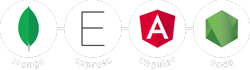

<div id="top"></div>

[![Forks][forks-shield]][forks-url]
[![Stargazers][stars-shield]][stars-url]
[![MIT License][license-shield]][license-url]
[![LinkedIn][linkedin-shield]][linkedin-url]

<!-- PROJECT LOGO -->
<br />
<div align="center">
  <a href="https://github.com/ahmed00078/Task-manager.git">
    
  </a>

  <h3 align="center">MEAN Stack Task Manager</h3>

  <p align="center">
    Project built using Angular, NodeJS, Express.j and MongoDB<br> with Angular Material to jump start your studies!
    <br />
    <a href="https://github.com/ahmed00078/Task-manager.git"><strong>Explore the docs »</strong></a>
    <br />
    <br />
    <a href="https://github.com/ahmed00078/Task-manager.git">View App*</a>
    ·
    <a href="https://mean-task-manager.onrender.com/api-docs">API Docs*</a>
  </p>
  <small>
    * hosted on render.com free tier, so API need a little time to start after accessing
  </small>
  <br>
  <br>
</div>

<!-- TABLE OF CONTENTS -->
<details>
  <summary>Table of Contents</summary>
  <ol>
    <li>
      <a href="#about-the-project">About The Project</a>
      <ul>
        <li><a href="#built-with">Built With</a></li>
        <li><a href="#hosting">Hosting</a></li>
      </ul>
    </li>
    <li>
      <a href="#getting-started">Getting Started</a>
      <ul>
        <li><a href="#prerequisites">Prerequisites</a></li>
        <li><a href="#installation">Installation</a></li>
      </ul>
    </li>
    <li><a href="#usage">Usage</a></li>
    <li><a href="#contributing">Contributing</a></li>
    <li><a href="#license">License</a></li>
    <li><a href="#contact">Contact</a></li>
    <li><a href="#donations">Donations</a></li>
  </ol>
</details>

<!-- ABOUT THE PROJECT -->

### Built With

- [Angular](https://angular.io/)
- [NodeJS](https://nodejs.org/en/)
- [MongoDB](https://www.mongodb.com/)
- [Express.js](https://expressjs.com/)
- [Angular Material](https://material.angular.io/)
- [Redis](https://redis.io/)
- [Swagger](https://swagger.io/)
- [Chart.js](https://www.chartjs.org/)
- [Yarn](https://www.yarnpkg.com/)

<p align="right">(<a href="#top">back to top</a>)</p>

### Hosting

This section shows what technologies are used in this particular project.

- <strong>MongoDB</strong> hosted on <a href="https://www.mongodb.com/pricing">MongoDB</a> shared cluster
- <strong>Redis</strong> hosted on <a href="https://render.com/pricing">Redis</a> free tier
- <strong>NodeJS</strong> hosted on <a href="https://render.com/pricing">NodeJS</a> free tier
- <strong>Angular</strong> hosted on <a href="https://pages.github.com/">Github Pages</a>

<p align="right">(<a href="#top">back to top</a>)</p>

<!-- GETTING STARTED -->

## Getting Started

After cloning the project, you need to do a few things to be able to run it.

### Prerequisites

You need to have the following requirements:

- mongodb <a target="_blank" href="https://www.mongodb.com/try/download/community/">(download here)</a>
- node 16.20.1 <a target="_blank" href="https://nodejs.org/en/download/">(download here)</a>
- redis <a target="_blank" href="https://redis.io/download/">(download here for Linux)</a> or <a target="_blank" href="https://github.com/tporadowski/redis/releases">(download here for windows)</a>
- yarn

  ```sh
  npm install -g yarn
  ```

- angular cli 14

  ```sh
  npm install -g @angular/cli@14
  ```

### Installation

_Below is an example of how you can run the project._<br>
_More scripts at package.json_

1. Clone the repo
   ```sh
   git clone https://github.com/ahmed00078/Task-manager.git
   ```
2. Install NPM packages via yarn
   ```sh
   yarn install
   ```
3. If running for the first time, run the following command to answer angular cli questions
   ```js
   ng serve
   ```
4. Run angular, express and mongoDB as development mode
   ```js
   yarn dev
   ```
5. Deploy to github pages
   ```js
   yarn deploy
   ```
   If needed, you can debug express using `yarn api-debug`. <br>More builds scripts at `./package.json`. <br>

<p align="right">(<a href="#top">back to top</a>)</p>

<!-- USAGE EXAMPLES -->

## Usage

You can import the Insomnia routes via file `./backend/db/routes-collection.json` and import the mongodb collections via file `./backend/db/routes-collection`. <br>Below are the implemented routes: you also can view them inside `./backend/routes` folder or through the Swagger documentation at `http://localhost:3000/api-docs/`.

```js
-------------------------------
-------- [USER ROUTES] --------
-------------------------------
[GET] localhost:3000/api/users -> 'getAll'
[GET] localhost:3000/api/users/{id} -> 'getOne'
[POST] localhost:3000/api/users -> 'create'
[PUT] localhost:3000/api/users/{id} -> 'update'
[DELETE] localhost:3000/api/users/{id}-> 'remove'
[POST] localhost:3000/api/users/authenticate -> 'authenticate'
[GET] localhost:3000/api/user/exists/{email}/ -> 'checkIfEmailExists'
[PUT] localhost:3000/api/users/changePassword/{id} -> 'changePassword'
[POST] localhost:3000/api/users/refreshToken -> 'refreshToken'
[POST] localhost:3000/api/users/logout -> 'logout'

-------------------------------
-------- [TASK ROUTES] --------
-------------------------------
[GET] localhost:3000/api/tasks?pageSize&searchTerm&pageIndex&sortFilter&sortDirection&startDate&finalDate -> 'getAll'
[GET] localhost:3000/api/tasks/{id} -> 'getOne'
[POST] localhost:3000/api/tasks -> 'create'
[PUT] localhost:3000/api/tasks/{id} -> 'update'
[DELETE] localhost:3000/api/tasks/{id}-> 'remove'

-------------------------------
------ [CATEGORY ROUTES] ------
-------------------------------
[GET] localhost:3000/api/categories?onlyMine -> 'getAll'
[POST] localhost:3000/api/categories -> 'create'
[DELETE] localhost:3000/api/categories/{id} -> 'remove'
```

<p align="right">(<a href="#top">back to top</a>)</p>

<!-- CONTRIBUTING -->

## Contributing

Contributions are what make the open source community such an amazing place to learn, inspire, and create. Any contributions you make are **greatly appreciated**.

If you have a suggestion that would make this better, please fork the repo and create a pull request. You can also simply open an issue with the tag "enhancement".
Don't forget to give the project a star! Thanks again!

1. Fork the Project
2. Create your Feature Branch (`git checkout -b feature/amazing-feature`)
3. Commit your Changes (`git commit -m 'feat: add some amazing feature'`)
4. Push to the Branch (`git push origin feature/amazing-feature`)
5. Open a Pull Request

<p align="right">(<a href="#top">back to top</a>)</p>

<!-- LICENSE -->

## License

Distributed under the MIT License. See [LICENSE](./LICENSE) for more information.

<p align="right">(<a href="#top">back to top</a>)</p>


Project Link: [https://github.com/ahmed00078/Task-manager.git](https://github.com/ahmed00078/Task-manager.git)

<p align="right">(<a href="#top">back to top</a>)</p>


<p align="right">(<a href="#top">back to top</a>)</p>
